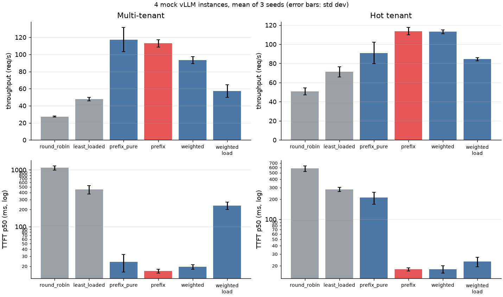

# kvrouter — a KV-cache-aware router for vLLM

A Go reverse proxy that sits in front of several OpenAI-compatible inference
servers (vLLM, SGLang, TGI) and sends each request to the instance most likely
to already hold its prompt prefix in KV cache — without letting cache affinity
turn one instance into a hot spot.

```
                       ┌────────────────────────── kvrouter ───────────────────────────┐
 client ─ POST /v1/chat │ extract prompt → chained block hashes → policy.Pick          │
   (SSE stream)  ─────► │   1. longest cached prefix among backends under load bound    │──► vLLM :8001
                        │   2. else rendezvous hash on first 8 blocks (cold prefix)     │──► vLLM :8002
                        │   3. retry on another backend if it fails before first byte   │──► vLLM :8003
                        │ active /health probes + passive ejection · /metrics · headers │──► vLLM :8004
                        └───────────────────────────────────────────────────────────────┘
```

Stdlib only, no dependencies. ~1,900 lines of Go (router, mock server, load generator) plus ~310 lines of tests; a small Python script turns the results into the tables and chart below.

## Results (4 instances, mock vLLM, mean of 3 seeds)



**Multi-tenant** — 16 tenants with ~3k-token system prompts, 128 conversations × 4 turns, 48 concurrent.

| policy | TTFT p50 | TTFT p90 | TTFT p99 | req/s | vs RR | cache hit | load imbalance |
|---|---:|---:|---:|---:|---:|---:|---:|
| round_robin | 1087 ms | 2485 ms | 3420 ms | 27.3 | 1.00× | 65.6% | 1.00 |
| least_loaded | 450 ms | 1684 ms | 2942 ms | 47.7 | 1.75× | 79.3% | 1.16 |
| prefix_pure (no load bound) | 24 ms | 628 ms | 1682 ms | 117.3 | 4.30× | 94.6% | 1.51 |
| **prefix** (bounded load) | **16 ms** | 656 ms | 1844 ms | 112.9 | 4.14× | 93.1% | 1.22 |
| weighted 3:2 (prefix:load) | 20 ms | 1149 ms | 2573 ms | 93.3 | 3.42× | 90.6% | 1.13 |
| weighted 1:2 | 235 ms | 1537 ms | 2640 ms | 57.1 | 2.09× | 83.2% | 1.19 |

**Hot tenant** — same, but 50% of conversations belong to one tenant.

| policy | TTFT p50 | TTFT p90 | TTFT p99 | req/s | vs RR | cache hit | load imbalance |
|---|---:|---:|---:|---:|---:|---:|---:|
| round_robin | 581 ms | 1372 ms | 1853 ms | 50.8 | 1.00× | 80.9% | 1.00 |
| least_loaded | 281 ms | 1013 ms | 1878 ms | 71.3 | 1.40× | 86.7% | 1.22 |
| prefix_pure (no load bound) | 212 ms | 619 ms | 1529 ms | 91.0 | 1.79× | 94.6% | **2.74** |
| **prefix** (bounded load) | **18 ms** | 632 ms | 1585 ms | **113.6** | **2.24×** | 93.0% | 1.32 |
| weighted 3:2 (prefix:load) | 18 ms | 668 ms | 1825 ms | 113.2 | 2.23× | 92.7% | 1.23 |
| weighted 1:2 | 23 ms | 949 ms | 1707 ms | 84.5 | 1.66× | 89.7% | 1.11 |

`weighted` is the scoring approach used by the Gateway API Inference Extension
and llm-d (see [Design](#comparison-policy-weighted-scoring--policy-weighted)),
run with two weightings.

**Failover** — prefix policy, `kill -9` one of four backends ~2 s into the run, restart it ~4 s later.
Across 3 runs: **14 errors in 4,599 requests**, all streams that were mid-flight on the
killed process (`kvrouter_midstream_errors_total`). Every request that arrived after the
crash succeeded (0–14 transparent retries per run). The backend was ejected on the first
broken connection and restored on its first good probe, then took traffic again with a
reset index. The cost of a crash shows up as a short TTFT bump rather than errors: in
two of the three runs p50 TTFT rises to ~190–270 ms for about a second after the kill, because the dead
instance's tenants get re-placed and have to be prefilled cold on their new owners.

Per-seed tables and raw JSON: [`results/seed{1,2,3}/`](results/). Spread across
seeds is small for p50 and hit rate; `prefix_pure` throughput varies most
(102–136 req/s) because its balance depends on where rendezvous hashing happens
to land 16 tenants.

### What the numbers say

- **Why round-robin loses:** with 16 × 3k-token prompts (≈48k tokens) and 32k
  tokens of cache per instance, round-robin makes every instance try to cache
  every tenant, so they thrash. Affinity routing partitions tenants, so the
  *aggregate* cache across the fleet is usable. That's also why TTFT p50 drops
  ~70×: almost every request only prefills its new turn.
- **Least-loaded is the honest baseline**, not round-robin. It already
  improves throughput 1.4–1.75×. Prefix-aware is still 1.6–2.4× its throughput.
- **The load bound earns its keep under skew.** Pure affinity pins the hot
  tenant to one instance (2.7× imbalance, p50 TTFT 212 ms). Bounded load
  spills it onto a second instance, which then caches that tenant too —
  replicating the hot prefix — and p50 falls to 18 ms with +25% throughput.
  Under uniform load it costs ~1.5 pts of hit rate and ~4% throughput, within
  `prefix_pure`'s seed-to-seed spread.
- **Weighted scoring matches it under skew but not under uniform load.** With
  prefix weight 3 and load weight 2, `weighted` ties `prefix` on the hot tenant
  (113 req/s, 18 ms p50). On the 16-tenant workload it's 17% slower with a 75%
  higher p90. The difference is cold placement: when no backend has a prompt
  cached, `weighted` has only the load term to go on, so a new tenant's first
  conversations land on whichever instances are idle, and the hit rate drops
  (90.6% vs 93.1%). `prefix` hashes cold prompts to one owner. Shifting the
  weights toward load (1:2) is worse on both workloads. The bounded-load policy
  needs no weight tuning to get both cases right.
- **Trade-off visible in p99:** pure affinity has slightly better p99 in the
  hot-tenant case. Each spill forces one cold 3k-token prefill on the new
  replica. p99 for all prefix policies is dominated by the cold-start burst
  at t=0 (48 cold conversations at once; see the failover timeline in
  `results/seed*/RESULTS.md` — p50 TTFT is ~1 s in second 0 and settles to ~15–30 ms once warm).

### How accurate is the router's index?

The router only *guesses* what each backend has cached (it records what it
sent). To measure the guess, the router reports how much of each prompt it
expected to be cached (`X-Router-Matched-Chars`) and the benchmark compares that
with the `cached_tokens` the backend actually reused. At the default 32k-token
cache the guess is rarely tested: for `prefix`, `prefix_pure` and `weighted 3:2`
under 1% of requests the router expected to hit were stale (`weighted 1:2`,
which spreads tenants across more instances, reaches 2–9%). With the mock's cache cut to 12k tokens per instance
(`scripts/index_drift.sh`, prefix policy, multi-tenant, 3 seeds):

| router index size | predicted hit | actual hit | expected-warm requests that were stale |
|---|---:|---:|---:|
| 4096 blocks (default) | 86.0% | 66.1% | 27.0% (range 17–32%) |
| 384 blocks (= the cache's capacity) | 82.2% | 69.4% | 20.6% (range 13–26%) |

"Stale" means the backend reused less than half of the prefix the router
expected. Under memory pressure the router overestimates its hit rate by ~13–20
points, and shrinking the index to the cache's size only partly helps: the
router and the engine evict in different orders. That's the case for building
the index from the engine's own KV-cache events (see Limitations).

> **Caveat:** these are from a simulator, not GPUs. `cmd/mockvllm` models an
> LRU prefix cache with vLLM's 16-token blocks, serialized prefill at ~10k
> tok/s, and batch-dependent decode. The *relative* effects are the point; the
> absolute numbers are not a vLLM benchmark. See "Running against real vLLM".

## Design

### Prefix hashing (`internal/prefix`)
The router hashes the prompt text in 128-byte blocks (≈32 tokens), each hash
chained to the previous one: `h[i] = H(h[i-1] ‖ block[i])`. This mirrors how
vLLM's automatic prefix caching keys KV blocks, so "shares `h[i]`" ⇔ "shares the
first `i+1` blocks". The router doesn't tokenize — it doesn't need the exact
blocks vLLM uses, only *same prefix → same chain*. Chat messages are flattened
in order so turn *n*'s prompt is a strict prefix of turn *n+1*'s.

### Prefix index (`internal/lru`)
Per backend, an LRU set of block hashes approximates what that backend has
cached. Chains are inserted deepest-first so eviction removes leaves before
roots (evicting a root would orphan the entire chain — vLLM also evicts
leaf-first). Lookup is a linear scan of the request's chain per backend:
O(backends × blocks) map lookups.

The index is **approximate and optimistic**: it's updated when the router
sends a request, not from the engine's real cache state. When a backend is
ejected its index is cleared, since a crash or restart loses its KV cache.

### Policy (`internal/router/policy.go`)
1. Compute the load bound `ceil(c · avg_inflight) + slack` (c = 1.25, slack = 2) —
   *consistent hashing with bounded loads* (Mirrokni, Thorup, Zadimoghaddam 2018).
2. Among backends under the bound, pick the one with the longest cached prefix.
   If the overall cache-best backend was over the bound, this is a `prefix_spill`.
3. Matches shorter than the affinity window (8 blocks ≈ 1 KB) don't count.
   Every prompt starts with the same chat-template/global header; without this
   rule, new tenants pile onto whichever backend saw that header first. (There's
   a regression test for this — `TestSharedHeaderDoesNotCountAsHit` — and the
   benchmark includes a 200-token shared header.)
4. Otherwise, rendezvous-hash the first 8 blocks across backends under the bound
   (`hash_affinity`), so a cold prompt's follow-ups land in the same place even
   before the index knows about it. If the rendezvous owner is overloaded, take
   the next one (`load_fallback`).

Every decision's reason is exposed as a metric label and an `X-Router-Reason`
response header, along with `X-Router-Backend`, `X-Router-Matched-Blocks` and
`X-Router-Matched-Chars` (how much of the prompt the router believes is cached,
which the benchmark checks against the backend's reported `cached_tokens`).

### Comparison policy: weighted scoring (`-policy weighted`)
For comparison, the router also implements the approach used by the Kubernetes
Gateway API Inference Extension and llm-d: each backend's score is a weighted
sum of a prefix-match score (matched blocks / prompt blocks) and a load score
(in-flight count, min-max normalized across backends), and the highest score
wins. There's no hard load cap, no minimum match and no rendezvous placement;
the whole trade-off lives in the weights (`-prefix-weight`, `-load-weight`).
One consequence of min-max normalization, pinned down in
`TestWeightedTradesCacheForLoad`: if the prefix weight exceeds the load weight,
a backend holding the full prefix wins no matter how busy it is.

### Failure handling (`internal/router/proxy.go`, `pool.go`)
- **Retries only before the first byte.** Once tokens have streamed to the
  client, replaying on another backend would duplicate output, so mid-stream
  failures are surfaced, not retried (`TestNoRetryAfterFirstByte`).
- **Passive health:** connection refused/reset ejects immediately; HTTP 5xx and
  timeouts eject after 3 in a row (slow ≠ dead).
- **Active health:** `GET /health` every second; restore on first success. A
  passing probe does not reset a healthy backend's failure streak, so an
  instance that answers `/health` but fails real requests still gets ejected
  (`TestHealthyProbeDoesNotHideRequestFailures`).
- **Panic routing:** if every backend is marked unhealthy, route to all of them
  anyway (as Envoy does) — the health checker may be what's broken.
- Streaming: 32 KB pooled buffers, flush per read, compression disabled so SSE
  is never buffered, up to 512 idle keep-alive connections per backend.
- Graceful shutdown drains in-flight streams for up to 30 s.

### Observability
`/metrics` (Prometheus text format): route decisions by reason, retries,
mid-stream errors, failed requests by status, per-backend in-flight / health /
served / index size, and an upstream time-to-first-byte histogram. `/debug/backends`
returns the same state as JSON. The benchmark can also scrape vLLM's own
`vllm:prefix_cache_{queries,hits}_total` counters; client-reported and
server-scraped hit rates agree to within 0.25 pts across all 27 runs here.

## Layout

```
cmd/router      the router
cmd/mockvllm    GPU-free vLLM stand-in: prefix cache, prefill contention, SSE, /metrics, fault injection
cmd/bench       multi-tenant multi-turn load generator → TTFT, throughput, cache hit, per-backend balance
cmd/report      results/*.json → markdown tables (one seed)
internal/prefix block hashing + prompt extraction
internal/lru    bounded hash set (router index and mock cache)
internal/router policies, proxy, health, metrics (+ tests)
scripts/bench.sh        full comparison + failover run (bash 3.2+, works on stock macOS)
scripts/index_drift.sh  router-index accuracy under KV-cache memory pressure
scripts/summarize.py    mean across seeds → README tables + docs/results.png
deploy/                 Dockerfile, docker-compose for real vLLM
```

## Run it

```bash
make test                      # go vet + go test -race (also run in CI)
./scripts/bench.sh             # ~2 min: 2 scenarios × 6 policies + failover, prints tables
make seeds drift summary       # ~8 min: everything behind the README numbers and chart

# by hand
go build -o bin/ ./cmd/...
for p in 8001 8002 8003 8004; do ./bin/mockvllm -port $p & done
./bin/router -backends http://127.0.0.1:8001,http://127.0.0.1:8002,http://127.0.0.1:8003,http://127.0.0.1:8004
./bin/bench -url http://127.0.0.1:9000
curl -s localhost:9000/metrics | grep route_decisions
```

Fault injection on the mock: `POST /admin/fault?rate=0.2` (random 503s),
`POST /admin/down` / `/admin/up` (fail health checks), `POST /reset` (drop cache).

## Running against real vLLM

`deploy/docker-compose.vllm.yml` starts vLLM instances (one GPU each) behind
the router. **It has not been run as part of this repo's results — that needs
GPUs.** Then:

```bash
BACKENDS=http://gpu-host:8001,http://gpu-host:8002 MODEL=Qwen/Qwen2.5-7B-Instruct NO_MOCK=1 \
BENCH_ARGS="-sys-tokens 2000 -concurrency 32" ./scripts/bench.sh
```

Notes for the real thing:
- Start vLLM with `--enable-prompt-tokens-details` so streamed usage includes
  `cached_tokens`; otherwise rely on the scraped `vllm:prefix_cache_*` counters.
- Reset caches between policies (restart, or vLLM's `/reset_prefix_cache`
  endpoint when the server runs in dev mode).
- Size the workload so total distinct prefixes exceed one instance's KV cache
  but fit the fleet's. That's the regime this router is for. If everything fits
  on every instance, round-robin hit rates converge with prefix routing.

## Limitations and next steps

- **Index is a guess, and the drift is measured above.** Under memory
  pressure a fifth to a third of "expected warm" requests are stale, and
  shrinking the index doesn't fix it. Next step: subscribe to the engine's
  KV-cache events (vLLM publishes `BlockStored` / `BlockRemoved` /
  `AllBlocksCleared` over ZMQ) and make the index exact, as llm-d's precise
  mode does. That needs token-level block hashes, i.e. the next bullet.
- **Byte blocks, not token blocks.** Fine for affinity, but it can't compute
  exact token savings. Using the model's tokenizer would allow cost-based
  scoring (e.g. `uncached_tokens × prefill_cost + queue_depth × step_time`)
  instead of "longest match under a load bound".
- **Load signal is router-local in-flight count.** With multiple router
  replicas, each sees only its own traffic. Options: scrape
  `vllm:num_requests_waiting` / KV usage from backends, or share the index
  across replicas.
- **No prefill/decode disaggregation awareness**, no LoRA-adapter affinity, no
  per-tenant fairness. Each would be a policy extension.

## Related work

This is a small, readable version of an idea production systems already ship.
None of the mechanisms are new; the point is to isolate them and measure the
trade-offs on one benchmark. How the main open-source routers balance cache
affinity against load:

| system | cache state | cache vs load trade-off |
|---|---|---|
| **kvrouter** (`prefix`) | approximate: per-backend LRU of byte-block hashes, from routing history | hard cap: bounded-load consistent hashing; minimum match length; rendezvous placement of cold prompts |
| [SGLang router](https://docs.sglang.ai/advanced_features/router.html) | approximate: per-worker radix tree of raw text, from routing history | switches to pure load balancing when workers are imbalanced; prefix match must exceed a threshold |
| [Gateway API Inference Extension](https://gateway-api-inference-extension.sigs.k8s.io/) / [llm-d](https://llm-d.ai/docs/architecture/advanced/kv-management/prefix-cache-aware-routing) | approximate, or (llm-d "precise") exact from vLLM KV events | weighted sum of prefix, queue-depth and KV-utilization scores (`weighted` here reproduces the prefix + queue part) |
| [NVIDIA Dynamo](https://docs.nvidia.com/dynamo/dev/integrations/kv_events_custom_engines.html) | exact, from engine KV events | (not compared here) |

Also worth reading: the vLLM production-stack router, and Mirrokni, Thorup &
Zadimoghaddam, *Consistent Hashing with Bounded Loads* (SODA 2018).
