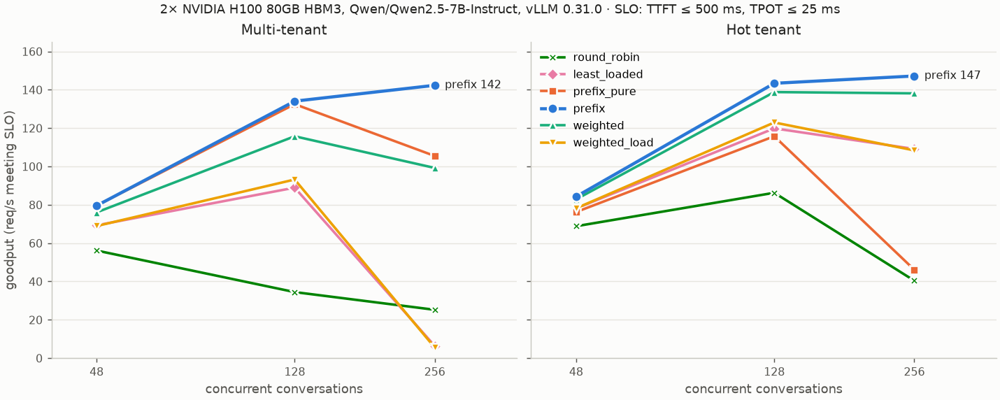

# kvrouter — a KV-cache-aware router for vLLM

A Go reverse proxy that sits in front of several OpenAI-compatible inference
servers (vLLM, SGLang, TGI) and sends each request to the instance most likely
to already hold its prompt prefix in KV cache — without letting cache affinity
turn one instance into a hot spot.

```
                       ┌────────────────────────── kvrouter ───────────────────────────┐
 client ─ POST /v1/chat │ extract prompt → chained block hashes → policy.Pick          │
   (SSE stream)  ─────► │   1. longest cached prefix among backends under load bound    │──► vLLM :8001
                        │   2. else rendezvous hash on first 8 blocks (cold prefix)     │──► vLLM :8002
                        │   3. retry on another backend if it fails before first byte   │──► vLLM :8003
                        │ active /health probes + passive ejection · /metrics · headers │──► vLLM :8004
                        └───────────────────────────────────────────────────────────────┘
```

Stdlib only, no dependencies. ~2,000 lines of Go (router, mock server, load generator) plus ~310 lines of tests; small Python scripts turn the results into the tables and charts below.

## Results on real GPUs (2× H100, vLLM 0.31.0)

Two vLLM servers, one H100 80GB each, serving Qwen2.5-7B-Instruct, with
`--gpu-memory-utilization 0.35` (≈198k tokens of KV cache per server). The
workload: 100 tenants × 3k-token system prompts (≈300k tokens, 1.5× one
server's cache), 600 conversations × 4 turns, 64 output tokens per request.
Each policy was run at 48, 128 and 256 concurrent conversations, with caches
reset between runs. **Goodput** = requests per second that met both SLOs:
TTFT ≤ 500 ms and time per output token ≤ 25 ms.



**Multi-tenant**: goodput, req/s (share of requests meeting the SLO)

| policy | 48 concurrent | 128 concurrent | 256 concurrent |
|---|---:|---:|---:|
| round_robin | 56 (98%) | 34 (53%) | 25 (45%) |
| least_loaded | 69 (99%) | 89 (83%) | 6 (11%) |
| prefix_pure (no load bound) | 80 (99%) | 132 (95%) | 105 (70%) |
| **prefix** (bounded load) | 80 (99%) | **134 (95%)** | **142 (85%)** |
| weighted 3:2 (prefix:load) | 76 (99%) | 116 (95%) | 99 (76%) |
| weighted 1:2 | 69 (98%) | 93 (86%) | 6 (10%) |

**Hot tenant** (50% of conversations on one tenant)

| policy | 48 concurrent | 128 concurrent | 256 concurrent |
|---|---:|---:|---:|
| round_robin | 69 (99%) | 86 (87%) | 40 (48%) |
| least_loaded | 78 (99%) | 120 (93%) | 109 (73%) |
| prefix_pure (no load bound) | 76 (99%) | 116 (94%) | 46 (38%) |
| **prefix** (bounded load) | 84 (99%) | **143 (95%)** | **147 (84%)** |
| weighted 3:2 (prefix:load) | 83 (99%) | 139 (95%) | 138 (85%) |
| weighted 1:2 | 78 (99%) | 123 (93%) | 108 (72%) |

**Multi-tenant at 256 concurrent**

| policy | TTFT p50 | TTFT p90 | ITL p99 | TPOT p90 | req/s | goodput | cache hit | load imbalance |
|---|---:|---:|---:|---:|---:|---:|---:|---:|
| round_robin | 1509 ms | 4537 ms | 197 ms | 52.1 ms | 56.3 | 25.2 (45%) | 66.6% | 1.00 |
| least_loaded | 1221 ms | 2306 ms | 195 ms | 52.6 ms | 59.5 | 6.4 (11%) | 62.5% | 1.09 |
| prefix_pure (no load bound) | 239 ms | 895 ms | 163 ms | 28.7 ms | 149.7 | 105.5 (70%) | 93.1% | 1.08 |
| **prefix** (bounded load) | 196 ms | 682 ms | 133 ms | 21.0 ms | 166.7 | 142.3 (85%) | 93.4% | 1.01 |
| weighted 3:2 (prefix:load) | 198 ms | 782 ms | 188 ms | 30.2 ms | 130.9 | 99.2 (76%) | 88.5% | 1.03 |
| weighted 1:2 | 1329 ms | 2486 ms | 195 ms | 53.3 ms | 57.3 | 5.5 (10%) | 60.5% | 1.10 |

### What the GPU numbers say

- **At light load, routing barely matters.** At 48 concurrent every policy meets
  the SLO for ~99% of requests; `prefix` only adds throughput (80 vs 56 req/s
  for round-robin). H100 prefill is fast enough that cache misses are cheap
  until the GPUs are busy.
- **The gap opens under load.** At 128 concurrent, `prefix` delivers 3.9× the
  goodput of round-robin and 1.5× least-loaded on the multi-tenant workload. At
  256 it holds 142 req/s while least-loaded collapses to 6: spreading requests
  by in-flight count scatters each conversation's turns across both servers,
  so its hit rate (62.5%) falls below even round-robin's and TTFT p50 passes a
  second.
- **The load bound earns its keep under skew, as in the simulator.** On the hot
  tenant at 256 concurrent, pure affinity sends 1.56× its share to one server
  and only 38% of requests meet the SLO; bounded load keeps balance at 1.03 and
  gets 3.2× the goodput (147 vs 46 req/s).
- **Weighted scoring again matches on skew but not on uniform load:** 138 vs 147
  req/s on the hot tenant, 99 vs 142 on the 100-tenant workload, where cold prompts land wherever load is lowest and the hit rate drops
  (88.5% vs 93.4%).
- **Decode latency improves too, which the simulator couldn't show.** At 256
  concurrent, `prefix` has TPOT p90 of 21 ms against ~52 ms for round-robin and
  least-loaded, and ITL p99 of 133 vs ~195 ms. Likely cause: fewer uncached
  tokens to prefill means fewer prefill chunks interleaved with decode steps.
- **The measurements are consistent.** Across all 48 runs (115,200 requests)
  there were no errors, the client-reported cache hit rate equals vLLM's own
  `vllm:prefix_cache_*` counters exactly, and none of the requests the router
  expected to be warm were stale. A repeat of the 48-concurrent pass matched the
  first within 0.6% on throughput.
- **The router underestimates its hits** (predicted 86% vs actual 93% for
  `prefix`). That's probably by design: it doesn't count the 200-token header
  every tenant shares (the minimum-match rule), which vLLM still reuses.

Raw results, `meta.json` and logs: [`results/gpu/`](results/gpu/); regenerate the
tables and chart with `.venv/bin/python scripts/summarize_gpu.py`. Failover was
not run on GPUs.

**Simulator vs real GPUs.** The simulator ran 4 servers with a slow simulated
prefill (~10k tok/s), so routing mattered even at 48 concurrent (4.2× round-robin
throughput there, vs 1.4× on 2× H100). The setups differ, so the absolute
numbers don't compare. What carried over is the ranking: `prefix` is best or
tied in every scenario at every load that stresses the GPUs, the load bound is
what saves it under skew, and `weighted` falls behind on uniform load because of
cold placement.

## Simulator results (4 instances, mock vLLM, mean of 3 seeds)


**Multi-tenant** — 16 tenants with ~3k-token system prompts, 128 conversations × 4 turns, 48 concurrent.
Goodput is requests per second that met both SLOs (TTFT ≤ 500 ms, time per output token ≤ 25 ms), with the share of requests that met them in brackets.

| policy | TTFT p50 | TTFT p90 | TTFT p99 | ITL p50 | ITL p99 | req/s | vs RR | goodput | cache hit | load imbalance |
|---|---:|---:|---:|---:|---:|---:|---:|---:|---:|---:|
| round_robin | 1152 ms | 2950 ms | 4036 ms | 12.5 ms | 26.0 ms | 26.0 | 1.00× | 7.9 (30%) | 64.8% | 1.00 |
| least_loaded | 568 ms | 1759 ms | 2578 ms | 12.4 ms | 29.5 ms | 45.0 | 1.73× | 19.7 (44%) | 77.3% | 1.18 |
| prefix_pure (no load bound) | 37 ms | 638 ms | 1692 ms | 12.6 ms | 43.0 ms | 114.4 | 4.40× | 100.9 (88%) | 94.6% | 1.51 |
| **prefix** (bounded load) | **24 ms** | 639 ms | 1667 ms | 12.3 ms | 45.4 ms | 108.6 | 4.18× | 93.4 (86%) | 93.1% | 1.19 |
| weighted 3:2 (prefix:load) | 37 ms | 1247 ms | 2667 ms | 12.2 ms | 54.1 ms | 86.9 | 3.34× | 72.4 (83%) | 90.1% | 1.16 |
| weighted 1:2 | 256 ms | 1413 ms | 2664 ms | 12.3 ms | 36.7 ms | 63.7 | 2.45× | 41.8 (66%) | 85.1% | 1.20 |

**Hot tenant** — same, but 50% of conversations belong to one tenant.

| policy | TTFT p50 | TTFT p90 | TTFT p99 | ITL p50 | ITL p99 | req/s | vs RR | goodput | cache hit | load imbalance |
|---|---:|---:|---:|---:|---:|---:|---:|---:|---:|---:|
| round_robin | 579 ms | 1484 ms | 1958 ms | 12.3 ms | 37.9 ms | 49.7 | 1.00× | 23.5 (47%) | 80.6% | 1.00 |
| least_loaded | 291 ms | 985 ms | 1921 ms | 12.2 ms | 42.0 ms | 72.2 | 1.45× | 50.8 (70%) | 87.1% | 1.19 |
| prefix_pure (no load bound) | 208 ms | 617 ms | 1521 ms | 14.9 ms | 41.0 ms | 91.5 | 1.84× | 80.1 (87%) | 94.7% | **2.74** |
| **prefix** (bounded load) | **26 ms** | 578 ms | 1600 ms | 12.5 ms | 43.4 ms | **112.7** | **2.27×** | **98.7 (88%)** | 93.3% | 1.26 |
| weighted 3:2 (prefix:load) | 31 ms | 717 ms | 1858 ms | 12.2 ms | 53.2 ms | 105.3 | 2.12× | 89.4 (85%) | 92.5% | 1.16 |
| weighted 1:2 | 73 ms | 965 ms | 1842 ms | 12.2 ms | 49.3 ms | 84.2 | 1.70× | 63.2 (75%) | 89.6% | 1.20 |

`weighted` is the scoring approach used by the Gateway API Inference Extension
and llm-d (see [Design](#comparison-policy-weighted-scoring--policy-weighted)),
run with two weightings.

**Failover** — prefix policy, `kill -9` one of four backends ~2 s into the run, restart it ~4 s later.
Across 3 runs: **8 errors in 4,596 requests** (4, 0 and 4 per run), all streams that were mid-flight on the
killed process (`kvrouter_midstream_errors_total`). Every request that arrived after the
crash succeeded (2–12 transparent retries per run). The backend was ejected on the first
broken connection and restored on its first good probe, then took traffic again with a
reset index. The cost of a crash shows up as a short TTFT bump rather than errors: in
two of the three runs p50 TTFT rises to ~140–330 ms for about a second after the kill, because the dead
instance's tenants get re-placed and have to be prefilled cold on their new owners.

Per-seed tables and raw JSON: [`results/seed{1,2,3}/`](results/). Spread across
seeds is small for p50 and hit rate; `prefix_pure` throughput varies most
(78–131 req/s) because its balance depends on where rendezvous hashing happens
to land 16 tenants.

### What the numbers say

- **Why round-robin loses:** with 16 × 3k-token prompts (≈48k tokens) and 32k
  tokens of cache per instance, round-robin makes every instance try to cache
  every tenant, so they thrash. Affinity routing partitions tenants, so the
  *aggregate* cache across the fleet is usable. That's also why TTFT p50 drops
  ~50×: almost every request only prefills its new turn.
- **Least-loaded is the honest baseline**, not round-robin. It already
  improves throughput 1.45–1.7×. Prefix-aware is still 1.6–2.4× its throughput.
- **Goodput widens the gap.** Under the SLO, `prefix` serves 4.7× the goodput of
  `least_loaded` on the 16-tenant workload (93 vs 20 req/s), against 2.4× on raw
  throughput, because most of least-loaded's requests miss the TTFT target.
- **The load bound earns its keep under skew.** Pure affinity pins the hot
  tenant to one instance (2.7× imbalance, p50 TTFT 208 ms). Bounded load
  spills it onto a second instance, which then caches that tenant too —
  replicating the hot prefix — and p50 falls to 26 ms with +23% throughput and goodput.
  Under uniform load it costs ~1.5 pts of hit rate and ~5% throughput, within
  `prefix_pure`'s seed-to-seed spread.
- **Weighted scoring nearly matches it under skew but not under uniform load.** With
  prefix weight 3 and load weight 2, `weighted` comes within 7% of `prefix` on the hot tenant
  (105 vs 113 req/s, inside the seed-to-seed spread). On the 16-tenant workload it's 20% slower with
  nearly twice the p90. The difference is cold placement: when no backend has a prompt
  cached, `weighted` has only the load term to go on, so a new tenant's first
  conversations land on whichever instances are idle, and the hit rate drops
  (90.1% vs 93.1%). `prefix` hashes cold prompts to one owner. Shifting the
  weights toward load (1:2) is worse on both workloads. The bounded-load policy
  needs no weight tuning to get both cases right.
- **Trade-off visible in p99:** pure affinity has slightly better p99 in the
  hot-tenant case. Each spill forces one cold 3k-token prefill on the new
  replica. p99 for all prefix policies is dominated by the cold-start burst
  at t=0 (48 cold conversations at once; see the failover timeline in
  `results/seed*/RESULTS.md` — p50 TTFT is ~0.8–1.3 s in second 0 and settles to ~15–60 ms once warm).
- **ITL says little here.** It's ~12 ms at p50 for every policy because the mock's decode
  step only slows with batch size; prefills never stall decoding, as they do in real vLLM.
  See the GPU results above for ITL and TPOT that mean something.

### How accurate is the router's index?

The router only *guesses* what each backend has cached (it records what it
sent). To measure the guess, the router reports how much of each prompt it
expected to be cached (`X-Router-Matched-Chars`) and the benchmark compares that
with the `cached_tokens` the backend actually reused. At the default 32k-token
cache the guess is rarely tested: for `prefix`, `prefix_pure` and `weighted 3:2`
under 1% of requests the router expected to hit were stale (`weighted 1:2`,
which spreads tenants across more instances, reaches up to 4%). With the mock's cache cut to 12k tokens per instance
(`scripts/index_drift.sh`, prefix policy, multi-tenant, 3 seeds):

| router index size | predicted hit | actual hit | expected-warm requests that were stale |
|---|---:|---:|---:|
| 4096 blocks (default) | 86.0% | 66.1% | 27.0% (range 17–32%) |
| 384 blocks (= the cache's capacity) | 82.2% | 69.4% | 20.6% (range 13–26%) |

"Stale" means the backend reused less than half of the prefix the router
expected. Under memory pressure the router overestimates its hit rate by ~13–20
points, and shrinking the index to the cache's size only partly helps: the
router and the engine evict in different orders. That's the case for building
the index from the engine's own KV-cache events (see Limitations).

> **Caveat:** the simulator results and the index-drift numbers come from
> `cmd/mockvllm`, not GPUs. It models an LRU prefix cache with vLLM's 16-token
> blocks, serialized prefill at ~10k tok/s, and batch-dependent decode. The
> *relative* effects are the point; for real vLLM numbers see the GPU results above.

## Design

### Prefix hashing (`internal/prefix`)
The router hashes the prompt text in 128-byte blocks (≈32 tokens), each hash
chained to the previous one: `h[i] = H(h[i-1] ‖ block[i])`. This mirrors how
vLLM's automatic prefix caching keys KV blocks, so "shares `h[i]`" ⇔ "shares the
first `i+1` blocks". The router doesn't tokenize — it doesn't need the exact
blocks vLLM uses, only *same prefix → same chain*. Chat messages are flattened
in order so turn *n*'s prompt is a strict prefix of turn *n+1*'s.

### Prefix index (`internal/lru`)
Per backend, an LRU set of block hashes approximates what that backend has
cached. Chains are inserted deepest-first so eviction removes leaves before
roots (evicting a root would orphan the entire chain — vLLM also evicts
leaf-first). Lookup is a linear scan of the request's chain per backend:
O(backends × blocks) map lookups.

The index is **approximate and optimistic**: it's updated when the router
sends a request, not from the engine's real cache state. When a backend is
ejected its index is cleared, since a crash or restart loses its KV cache.

### Policy (`internal/router/policy.go`)
1. Compute the load bound `ceil(c · avg_inflight) + slack` (c = 1.25, slack = 2) —
   *consistent hashing with bounded loads* (Mirrokni, Thorup, Zadimoghaddam 2018).
2. Among backends under the bound, pick the one with the longest cached prefix.
   If the overall cache-best backend was over the bound, this is a `prefix_spill`.
3. Matches shorter than the affinity window (8 blocks ≈ 1 KB) don't count.
   Every prompt starts with the same chat-template/global header; without this
   rule, new tenants pile onto whichever backend saw that header first. (There's
   a regression test for this — `TestSharedHeaderDoesNotCountAsHit` — and the
   benchmark includes a 200-token shared header.)
4. Otherwise, rendezvous-hash the first 8 blocks across backends under the bound
   (`hash_affinity`), so a cold prompt's follow-ups land in the same place even
   before the index knows about it. If the rendezvous owner is overloaded, take
   the next one (`load_fallback`).

Every decision's reason is exposed as a metric label and an `X-Router-Reason`
response header, along with `X-Router-Backend`, `X-Router-Matched-Blocks` and
`X-Router-Matched-Chars` (how much of the prompt the router believes is cached,
which the benchmark checks against the backend's reported `cached_tokens`).

### Comparison policy: weighted scoring (`-policy weighted`)
For comparison, the router also implements the approach used by the Kubernetes
Gateway API Inference Extension and llm-d: each backend's score is a weighted
sum of a prefix-match score (matched blocks / prompt blocks) and a load score
(in-flight count, min-max normalized across backends), and the highest score
wins. There's no hard load cap, no minimum match and no rendezvous placement;
the whole trade-off lives in the weights (`-prefix-weight`, `-load-weight`).
One consequence of min-max normalization, pinned down in
`TestWeightedTradesCacheForLoad`: if the prefix weight exceeds the load weight,
a backend holding the full prefix wins no matter how busy it is.

### Failure handling (`internal/router/proxy.go`, `pool.go`)
- **Retries only before the first byte.** Once tokens have streamed to the
  client, replaying on another backend would duplicate output, so mid-stream
  failures are surfaced, not retried (`TestNoRetryAfterFirstByte`).
- **Passive health:** connection refused/reset ejects immediately; HTTP 5xx and
  timeouts eject after 3 in a row (slow ≠ dead).
- **Active health:** `GET /health` every second; restore on first success. A
  passing probe does not reset a healthy backend's failure streak, so an
  instance that answers `/health` but fails real requests still gets ejected
  (`TestHealthyProbeDoesNotHideRequestFailures`).
- **Panic routing:** if every backend is marked unhealthy, route to all of them
  anyway (as Envoy does) — the health checker may be what's broken.
- Streaming: 32 KB pooled buffers, flush per read, compression disabled so SSE
  is never buffered, up to 512 idle keep-alive connections per backend.
- Graceful shutdown drains in-flight streams for up to 30 s.

### Observability
`/metrics` (Prometheus text format): route decisions by reason, retries,
mid-stream errors, failed requests by status, per-backend in-flight / health /
served / index size, and an upstream time-to-first-byte histogram. `/debug/backends`
returns the same state as JSON. The benchmark can also scrape vLLM's own
`vllm:prefix_cache_{queries,hits}_total` counters; client-reported and
server-scraped hit rates agree to within 0.25 pts across all 27 runs here.

## Layout

```
cmd/router      the router
cmd/mockvllm    GPU-free vLLM stand-in: prefix cache, prefill contention, SSE, /metrics, fault injection
cmd/bench       multi-tenant multi-turn load generator → TTFT, throughput, cache hit, per-backend balance
cmd/report      results/*.json → markdown tables (one seed)
internal/prefix block hashing + prompt extraction
internal/lru    bounded hash set (router index and mock cache)
internal/router policies, proxy, health, metrics (+ tests)
scripts/bench.sh        full comparison + failover run (bash 3.2+, works on stock macOS)
scripts/index_drift.sh  router-index accuracy under KV-cache memory pressure
scripts/summarize.py    mean across seeds → README tables + docs/results.png
scripts/summarize_gpu.py  GPU load sweep → README tables + docs/gpu_goodput.png
scripts/gpu_run.sh      the same comparison against real vLLM on one GPU host
deploy/                 Dockerfile, docker-compose for 4 pinned vLLM servers
```

## Run it

```bash
make test                      # go vet + go test -race (also run in CI)
./scripts/bench.sh             # ~2 min: 2 scenarios × 6 policies + failover, prints tables
make seeds drift summary       # ~8 min: everything behind the README numbers and chart

# by hand
go build -o bin/ ./cmd/...
for p in 8001 8002 8003 8004; do ./bin/mockvllm -port $p & done
./bin/router -backends http://127.0.0.1:8001,http://127.0.0.1:8002,http://127.0.0.1:8003,http://127.0.0.1:8004
./bin/bench -url http://127.0.0.1:9000
curl -s localhost:9000/metrics | grep route_decisions
```

Fault injection on the mock: `POST /admin/fault?rate=0.2` (random 503s),
`POST /admin/down` / `/admin/up` (fail health checks), `POST /reset` or
`/reset_prefix_cache` (drop cache).

## Running against real vLLM

On a host with 2–4 NVIDIA GPUs, docker and nvidia-container-toolkit (e.g. a
Lambda Cloud instance with Lambda Stack):

```bash
HF_TOKEN=hf_... scripts/gpu_run.sh                     # 4 GPUs, Qwen2.5-7B-Instruct
NUM_GPUS=2 MODEL=meta-llama/Llama-3.1-8B-Instruct scripts/gpu_run.sh

# the load sweep behind the GPU results above (~25 min on 2× H100)
for c in 48 128 256; do
  OUT=results/gpu/h100x2_c$c CONCURRENCY=$c SLO_TTFT=500ms SLO_TPOT=25ms \
  NUM_GPUS=2 GPU_MEM_UTIL=0.35 scripts/gpu_run.sh 2>&1 | tee run_c$c.log
done
```

It checks the host, starts that many vLLM servers from
`deploy/docker-compose.vllm.yml` (pinned to v0.31.0), waits for them to be
healthy, then runs every policy with caches reset in between
(`/reset_prefix_cache`, enabled by `VLLM_SERVER_DEV_MODE=1`). Results land in
`results/gpu/<timestamp>/` with a `meta.json` recording the git commit, model,
vLLM version, GPUs and benchmark arguments. Go is optional on the host.

The workload is sized from the KV-cache capacity vLLM logs at startup: distinct
prefixes come to about half the fleet's cache, and at least 1.5 servers' worth.
On large GPUs, lower `GPU_MEM_UTIL` to keep the workload (and the run) small;
on 80 GB cards the default 0.9 would mean hours per pass.
That's the regime this router is for. If everything fits on every instance,
round-robin hit rates converge with prefix routing. Override with `TENANTS`,
`SYS_TOKENS`, `CONVS`, `MAX_TOKENS`, `SLO_TTFT` and `SLO_TPOT`. The failover
scenario runs only against the mock.

## Limitations and next steps

- **Index is a guess, and the drift is measured above.** Under memory
  pressure a fifth to a third of "expected warm" requests are stale, and
  shrinking the index doesn't fix it. Next step: subscribe to the engine's
  KV-cache events (vLLM publishes `BlockStored` / `BlockRemoved` /
  `AllBlocksCleared` over ZMQ) and make the index exact, as llm-d's precise
  mode does. That needs token-level block hashes, i.e. the next bullet.
- **Byte blocks, not token blocks.** Fine for affinity, but it can't compute
  exact token savings. Using the model's tokenizer would allow cost-based
  scoring (e.g. `uncached_tokens × prefill_cost + queue_depth × step_time`)
  instead of "longest match under a load bound".
- **Load signal is router-local in-flight count.** With multiple router
  replicas, each sees only its own traffic. Options: scrape
  `vllm:num_requests_waiting` / KV usage from backends, or share the index
  across replicas.
- **No prefill/decode disaggregation awareness**, no LoRA-adapter affinity, no
  per-tenant fairness. Each would be a policy extension.

## Related work

This is a small, readable version of an idea production systems already ship.
None of the mechanisms are new; the point is to isolate them and measure the
trade-offs on one benchmark. How the main open-source routers balance cache
affinity against load:

| system | cache state | cache vs load trade-off |
|---|---|---|
| **kvrouter** (`prefix`) | approximate: per-backend LRU of byte-block hashes, from routing history | hard cap: bounded-load consistent hashing; minimum match length; rendezvous placement of cold prompts |
| [SGLang router](https://docs.sglang.ai/advanced_features/router.html) | approximate: per-worker radix tree of raw text, from routing history | switches to pure load balancing when workers are imbalanced; prefix match must exceed a threshold |
| [Gateway API Inference Extension](https://gateway-api-inference-extension.sigs.k8s.io/) / [llm-d](https://llm-d.ai/docs/architecture/advanced/kv-management/prefix-cache-aware-routing) | approximate, or (llm-d "precise") exact from vLLM KV events | weighted sum of prefix, queue-depth and KV-utilization scores (`weighted` here reproduces the prefix + queue part) |
| [NVIDIA Dynamo](https://docs.nvidia.com/dynamo/dev/integrations/kv_events_custom_engines.html) | exact, from engine KV events | (not compared here) |

Also worth reading: the vLLM production-stack router, and Mirrokni, Thorup &
Zadimoghaddam, *Consistent Hashing with Bounded Loads* (SODA 2018).
